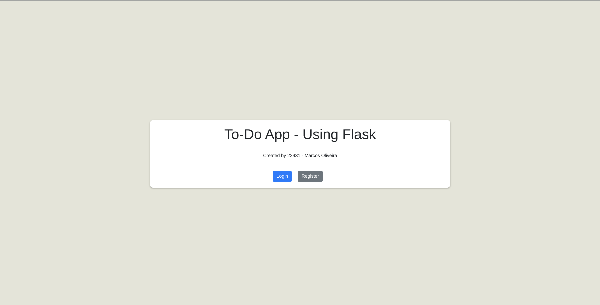
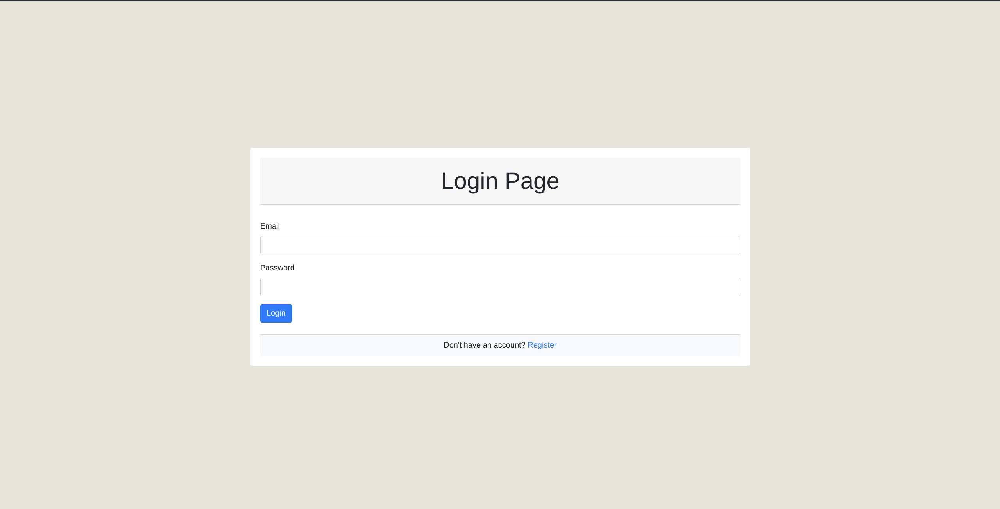

# CA4 Flask TODO App
- Student n: `22931`
- Student name: `Marcos Oliveira`
- Tutor: [Geoff-Wright](https://github.com/Geoff-Wright)

This is a simple Flask app for managing a todo list, with items stored in a MongoDB database. The app allows users to submit new items with a content and degree field, where degree can be either "Important" or "Unimportant". The app then displays all the items in the database on the same page.

<p align="center">
  
</p>

<p align="center">
  
</p>

## Requirements
To run this app, you need:

- Python 3.x
- Flask
- PyMongo
- Installation
- Clone the repository:

## In the App
Set up the MongoDB Atlas cluster and create a user with read/write access to a database and a collection. Then, replace:
```python
# Instance of the MongoClient class from the PyMongo library
client = MongoClient('mongodb+srv://<USERNAME>:<PASSWORD>@cluster0.tbouul8.mongodb.net/?retryWrites=true&w=majority')

# Make sure to replace <username>, <password>, <clustername>, and <dbname> with the appropriate values for your MongoDB Atlas cluster.
```

## Run the app

Copy and run this code:
> python app.py

In your browser, go to `http://localhost:5000` to see the app in action.

## Usage
To use the app, simply enter a new todo item in the form and choose its `Important` or `Unimportant`, then click the "Submit" button. The new item will be added to the database and displayed on the same page. You can add as many items as you want and they will all be persisted in the database.

## Acknowledgments
This app was built with Flask and PyMongo, using MongoDB Atlas for cloud database hosting. The HTML and CSS for the app were adapted from a template found on `Bootstrap`.

## References
- [How To Use MongoDB in a Flask Application](https://www.digitalocean.com/community/tutorials/how-to-use-mongodb-in-a-flask-application)
- [How To Install MongoDB on Ubuntu 20.04](https://www.digitalocean.com/community/tutorials/how-to-install-mongodb-on-ubuntu-20-04)
- [PyMongo](https://pymongo.readthedocs.io/en/stable/)
- [Flask](https://flask.palletsprojects.com/en/1.1.x/)
- [Bootstrap](https://getbootstrap.com/docs/5.3/getting-started/introduction/)

## Copyright Disclaimer
Please note that this app project is part of Dorset College's sophomore semester final project, however, it may contain some part of code that may be copyrighted, if so, please contact me so I can delete or give due to copyright. All the people were duly referenced in the "References" section above.

Please note that this project is non-profit or not intended to be monetized.

---

<strong>Built with 💙 by [@Marcos Oliveira](https://www.linkedin.com/in/pgmarcosoliveira/)</strong>